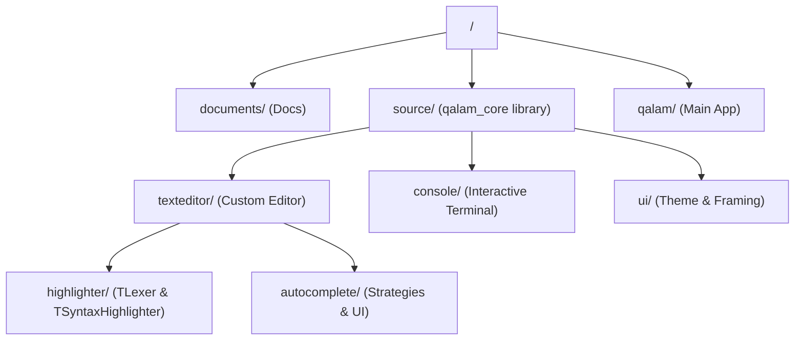

# Qalam IDE Internals

This document describes the internal architecture and component relationships of the Qalam IDE.

## High-Level Architecture

Qalam IDE is built using **Qt 6 (C++23)** and follows a modular design. The project is split into two main parts:

1.  **`qalam_core` (Static Library):** Contains all the reusable logic and UI components (Editor, Console, Settings, etc.).
2.  **`Qalam` (Application):** The main entry point that assembles the components into the final IDE.

## Directory Structure

### Key Components

#### 1. Text Editor (`source/texteditor`)
The heart of Qalam is `TEditor`, a custom `QPlainTextEdit` subclass.
- **`TLexer`:** A state-based lexer that tokens are used for both syntax highlighting and auto-completion.
- **`TSyntaxHighlighter`:** Integrates `TLexer` with Qt's `QSyntaxHighlighter` for real-time coloring.
- **`AutoComplete`:** Provides context-aware suggestions for Baa keywords and snippets.

#### 2. Console (`source/console`)
`TConsole` provides an interactive terminal.
- **`ProcessWorker`:** Handles background execution of the compiler or external scripts to keep the UI responsive.

#### 3. Framing & Theme (`source/ui`)
- **`QalamWindow`:** Handles the frameless window implementation and custom title bars.
- **`QalamTheme`:** Managed CSS-based themes for consistent styling across components.

## Development Workflow

### Adding a new keyword
To add a new keyword to the Baa language in the IDE:
1.  Update `source/texteditor/highlighter/TSyntaxDefinition.cpp` in the `LanguageDefinition` constructor.
2.  (Optional) Add a snippet in the autocomplete logic if needed.

### Build System
The project uses **CMake** as the primary build system. The root `CMakeLists.txt` manages subdirectories and shared configuration.

- `source/CMakeLists.txt`: Defines the `qalam_core` static library.
- `qalam/CMakeLists.txt`: Defines the final `Qalam` executable.
